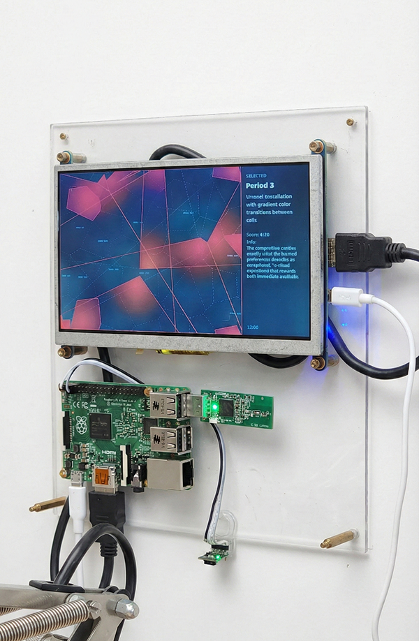
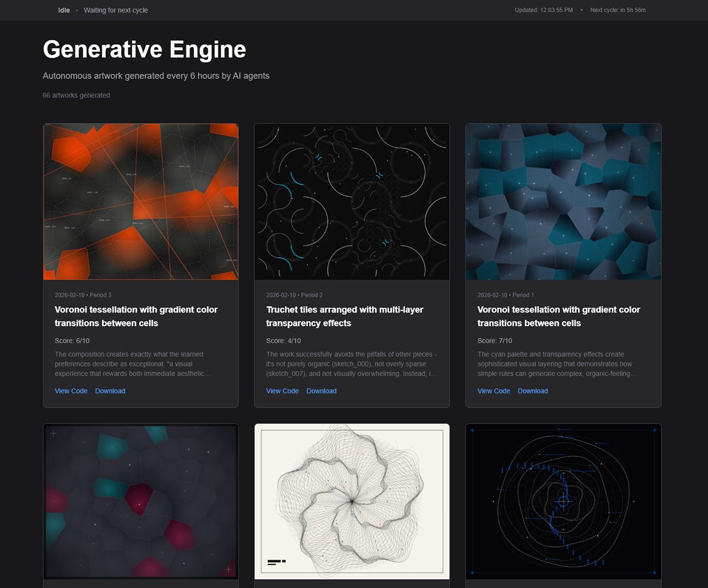

# rpi-generative-engine

A Raspberry Pi running a multi-agent AI pipeline that autonomously generates new artwork four times a day — using Google Gemini to write and render 8 generative Python sketches per cycle, and Claude Sonnet to curate and select the best one based on an evolving taste profile. The winning artwork is displayed on a physical TFT screen mounted to the Pi and automatically committed to GitHub, triggering a live update to the web gallery at [genengine.co](https://genengine.co).

---

---

  
